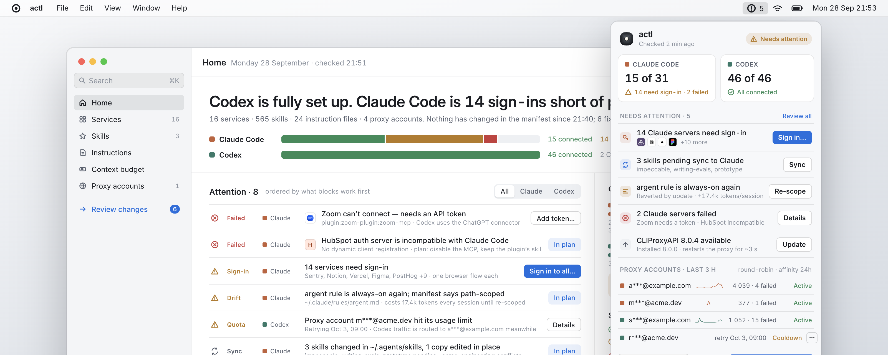
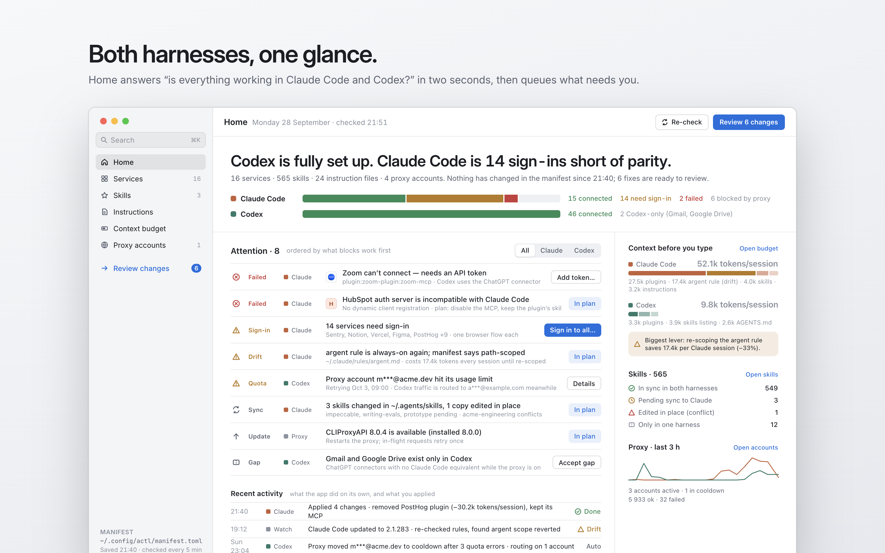
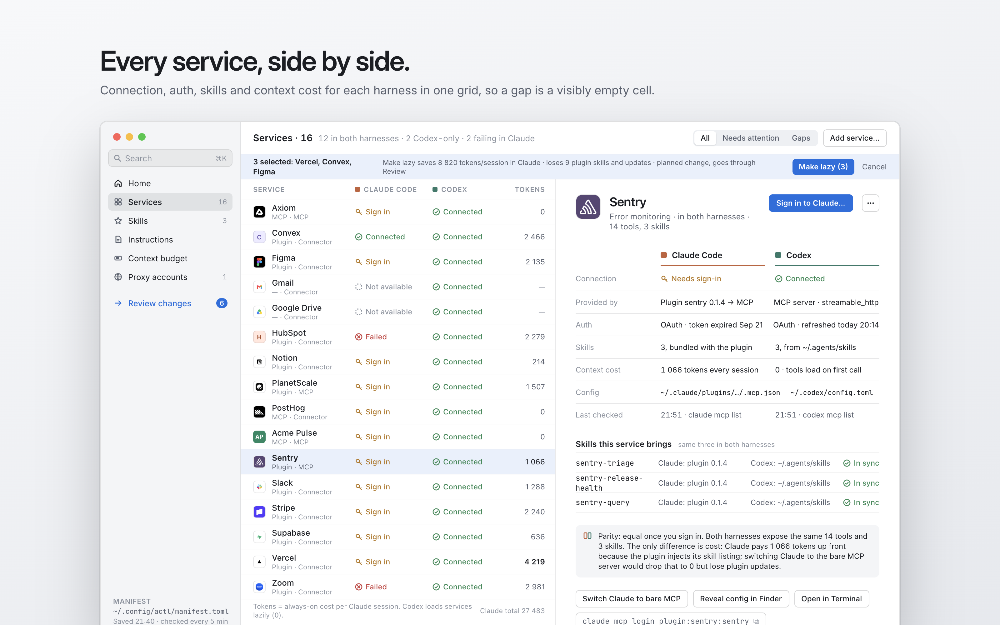
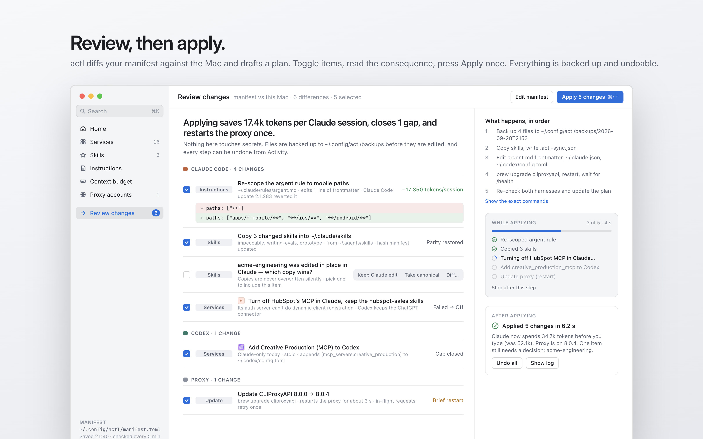
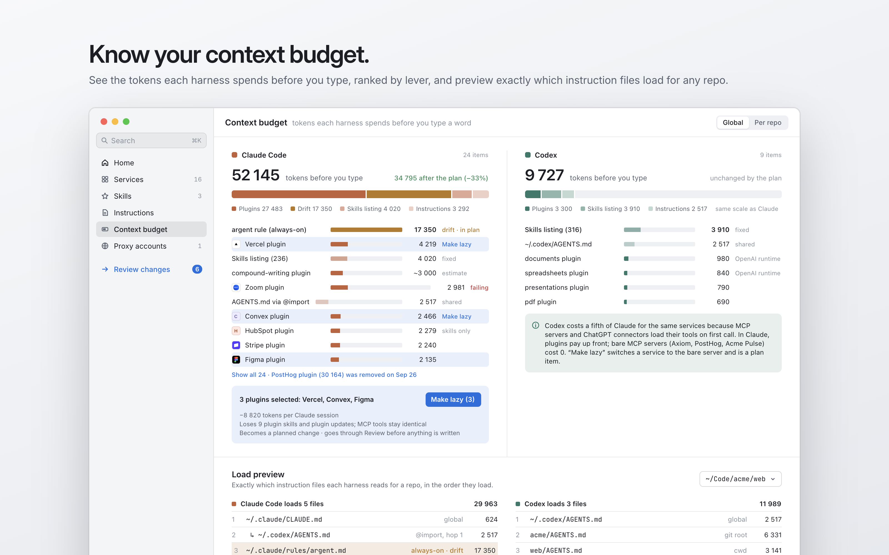
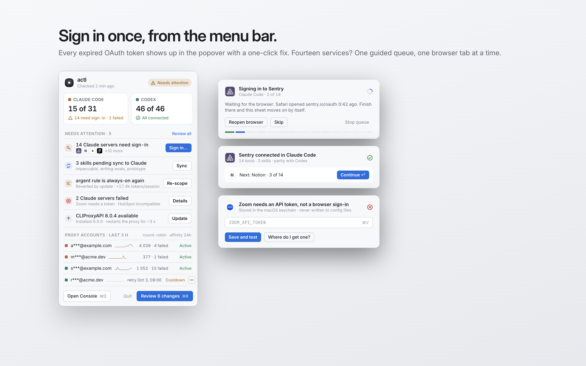
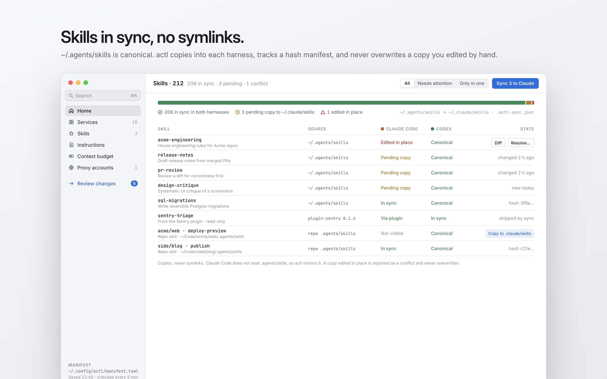

<p align="center">
  
</p>

<h1 align="center">actl</h1>

<p align="center">
  <em>Pronounced "actual".</em> The actual state of your coding agents.<br>
  Instructions, skills, MCP servers, plugins and sign-ins, kept at parity across Claude Code and Codex.
</p>

<p align="center">
  <picture>
    <source media="(prefers-color-scheme: dark)" srcset="design/brand/hero-dark.png">
    
  </picture>
</p>

> **Status:** the native macOS app shown here is in design ([docs/mac-app.md](docs/mac-app.md)). What works today is the `actl` engine and CLI, plus a local web dashboard. They inventory everything below, keep skills in sync, run MCP sign-ins, and report drift.

If you use more than one coding agent, your setup drifts. A connector gets signed in on one tool but not the other. A plugin update quietly doubles your context. A skill exists in one harness and not the other. An update reverts a setting. actl shows what is actually configured on your Mac, compares it with what you meant, and turns every difference into a change you can review.

## Features

### Both harnesses, one glance
Home answers "is everything working in Claude Code and Codex?" in two seconds, then queues what needs you, ordered by what blocks work first.



### Every service, side by side
Connection, auth, skills and context cost for each harness in one grid, so a gap is a visibly empty cell. A service can be provided by a plugin, an MCP server or a ChatGPT connector; actl treats them as the same thing.



### Review, then apply
actl compares your manifest with the Mac and drafts a plan. You toggle items, read the consequence of each, and apply once. Files are backed up before they are edited, and every step can be undone.



### Know your context budget
See the tokens each harness spends before you type, ranked by lever. Load preview shows exactly which instruction files each harness reads for a repo, in order.



### Sign in once, from the menu bar
Every expired OAuth token shows up in the menu bar with a one-click fix. Several sign-ins run as one guided queue.



### Skills in sync, no symlinks
`~/.agents/skills` is canonical. actl copies skills into each harness, tracks a hash manifest, and never overwrites a copy you edited by hand.



## What it covers

- **Instructions:** global and per-repo `AGENTS.md`, `CLAUDE.md`, `CLAUDE.local.md` and `.claude/rules`, and which harness loads each one.
- **Skills:** `~/.claude/skills`, `~/.agents/skills`, `~/.codex/skills`, repo `.claude/skills` and `.agents/skills`, and plugin skills, with per-harness visibility.
- **MCP servers and connectors:** one matrix across harnesses. Claude status comes from `claude mcp list` (a live health check), and Codex status from `codex mcp list --json` plus its ChatGPT connector plugins.
- **Plugins:** Claude `enabledPlugins` and Codex plugins.
- **Findings:** dead links, servers present in only one harness, blocked connectors, duplicate instruction files, skills awaiting sync, and settings an update reverted.
- **Harnesses:** Claude Code and Codex are managed. Cursor, Gemini CLI, OpenCode and Copilot CLI are detected, with support to come.
- **Optional integrations:** a [CLIProxyAPI](https://github.com/router-for-me/CLIProxyAPI) subscription pool (account health, cooldowns, traffic and version), with its management key kept out of the browser.

## Setup

Requirements: macOS, [Bun](https://bun.sh), and at least one supported harness (Claude Code and/or Codex).

```sh
git clone https://github.com/jamielmccormick/actl && cd actl
bun src/actl.ts findings | jq      # works with no configuration
```

Configuration is optional. Create `~/.config/actl/config.toml` to change the defaults:

```toml
[scan]
roots = ["~/Code"]                 # default: ~/Code, ~/Developer, ~/Projects, ~/src, … whichever exist
workspaces = ["~/Documents/Notes"] # folders whose children hold AGENTS.md/CLAUDE.md

[proxy]                            # optional CLIProxyAPI integration
enabled = "auto"                   # "auto" (use it if it's running and a key exists) | true | false
endpoint = "http://127.0.0.1:8317"
key_file = "~/.cli-proxy-api/management-key"
```

Tool homes follow each tool's own overrides: `CLAUDE_CONFIG_DIR`, `CODEX_HOME` and `XDG_CONFIG_HOME`. Repos are discovered from your scan roots and from every project your harnesses have opened.

## CLI

The engine is the `actl` CLI. The Mac app uses it, and so can you or your agents. Every state command prints `{ schema, command, generatedAt, data }`. See [docs/engine-contract.md](docs/engine-contract.md).

```sh
bun src/actl.ts status                    # fast summary for the menu bar (reads the cache)
bun src/actl.ts inventory|services|budget # full inventory, services across harnesses, context budget
bun src/actl.ts budget --repo=~/Code/app  # plus the exact instruction files each harness loads there
bun src/actl.ts manifest adopt            # write ~/.config/actl/manifest.toml from your current setup
bun src/actl.ts plan                      # manifest vs this Mac: the changes actl would make
bun src/actl.ts apply <id...>             # apply named actions; files are backed up first
bun src/actl.ts activity | undo <runId>   # history, and undo a run
bun src/actl.ts login claude|codex <server>
bun test                                  # engine tests, run against fixture home directories
bun run build:engine                      # single self-contained binary at build/actl
```

## Web dashboard (until the Mac app ships)

```sh
bun src/server.ts          # http://127.0.0.1:4777
```

The server binds to `127.0.0.1` only. The inventory is cached for five minutes. **Refresh** re-collects it, which takes about 5–15 seconds because `claude mcp list` health-checks every server.

## Skills sync

`~/.agents/skills` is the canonical, cross-tool location, and Codex reads it natively. `bun src/skills-sync.ts --apply` copies skills into `~/.claude/skills`, and into a repo's `.claude/skills` when the repo gitignores it. No symlinks are used.

A hash manifest (`.actl-sync.json`) tracks every copy:
- When a source changes, its copy is re-copied.
- A copy edited in place is reported as a conflict and never overwritten.
- Skills that exist only in `~/.claude/skills` are promoted to `~/.agents/skills`.
- Skills a Claude plugin already provides are skipped.

Without `--apply`, it prints the plan.

## Safety

- **Writes are limited** to starting an MCP sign-in and to skills sync. Everything else is read-only; where a fix exists, actl shows the command.
- **No secrets leave the engine.** actl reads server names, URLs and commands, never env values, headers or tokens. The CLIProxyAPI management key stays on the server side, only an allowlist of GET routes is called, and a single 401 stops further calls, because five failures ban localhost for 30 minutes.
- **The dashboard defends itself.** POST requests need an `x-actl` header and a same-origin `Origin`, and every `/api` route rejects non-loopback `Host` headers.
- **No telemetry.**

## Background: how each harness loads configuration

Checked 2026-09-28, with Claude Code 2.1.283 and codex-cli 0.158.0.

| | Claude Code | Codex |
| - | - | - |
| Global instructions | `~/.claude/CLAUDE.md`, `~/.claude/rules/*.md` | `~/.codex/AGENTS.md` |
| Project instructions | `CLAUDE.md`, plus `AGENTS.md` when there is no CLAUDE file or with mode `claude-md-and-agents-md`. Nested files load when Claude reads files in that directory | `AGENTS.md` from the git root down to the cwd, nothing below the cwd, 32 KiB combined cap |
| Imports | `@path`, up to 4 hops | None |
| Skills | `~/.claude/skills`, `.claude/skills`, plugins. **Does not read `.agents/skills`** | `~/.agents/skills`, repo `.agents/skills`, `~/.codex/skills` (legacy), plugins |
| MCP | `~/.claude.json` (user/local), `.mcp.json` (project), plugins, claude.ai connectors | `~/.codex/config.toml` `[mcp_servers]`, project `.codex/config.toml`, plugins, ChatGPT connectors |

claude.ai connectors load only under a claude.ai login. When `ANTHROPIC_AUTH_TOKEN` or `ANTHROPIC_BASE_URL` is set, for example by a proxy, they are disabled. Register the servers you need directly instead.

## License

[MIT](LICENSE) © Jamie McCormick
